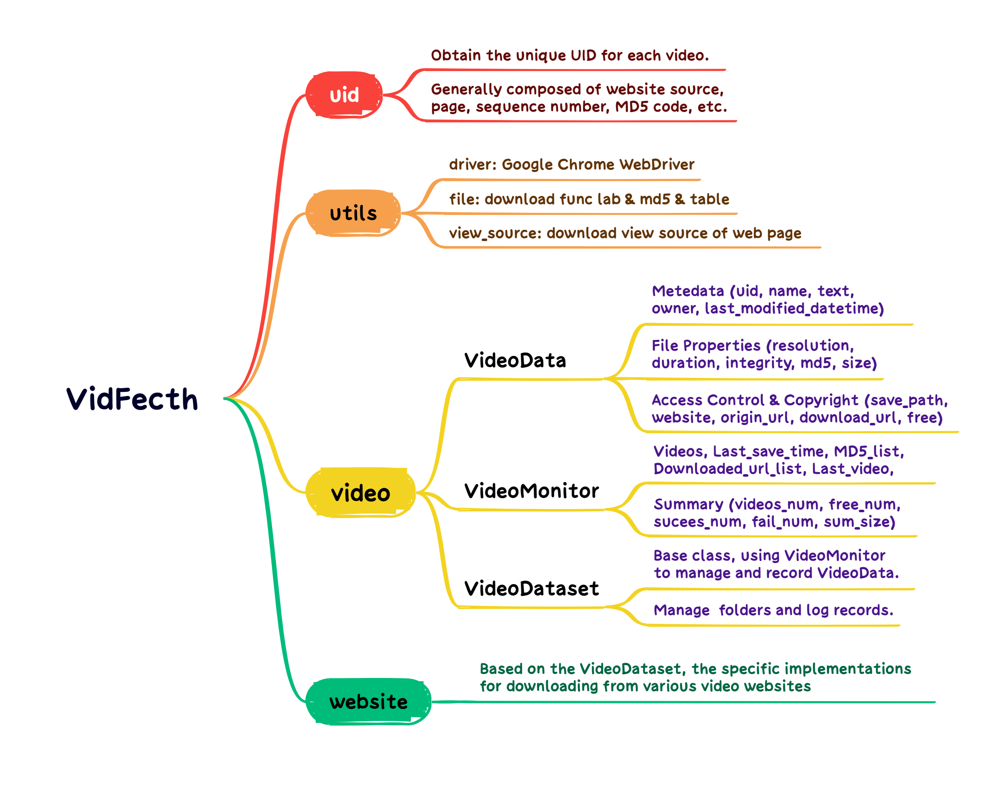

**SJTU-TES**, SJTU Technology Engage Square, is an inclusive platform that aims to replicate cutting-edge technologies from diverse fields, enabling beginners to gain practical experience through hands-on projects and activities. 

We mark work contributed by **SJTU** with ⭐.

## [Content](#content)

<table>
<tr><td colspan="2"><a href="#AIGC">1. AIGC</a></td></tr> 
<tr>
	<td>&emsp;<a href=#text2img>1.1 Text2Img</a></td>
	<td>&emsp;<a href=#text2video>1.2 Text2Video</a></td>
</tr>
<tr>
	<td>&emsp;<a href=#deepfake>1.3 DeepFake</a></td>
</tr>

<tr><td colspan="2"><a href="#CO">2. CO</a></td></tr> 
<tr>
	<td>&emsp;<a href=#graph-matching>2.1 Graph Matching (GM)</a></td>
	<td>&emsp;<a href=#graph-edit-distance>2.2 Graph Edit Distance (GED)</a></td>
</tr>
<tr>
	<td>&emsp;<a href=#travelling-salesman-problem>2.3 Travelling Salesman Problem (TSP)</a></td>
	<td>&emsp;<a href=#maximum-independent-set>2.4 Maximum Independent Set (MIS)</a></td>
</tr>

<tr><td colspan="2"><a href="#website">3. Website</a></td></tr> 
<tr>
	<td>&emsp;<a href=#online-chatting>3.1 Online Chatting</a></td>
	<td>&emsp;<a href=#web-scraping>3.2 Web Scraping</a></td>
</tr>

</table>

## [AIGC](#content)

### [Text2Img](#content)

#### 1.1.1 Stable Diffusion v1.4  

``Stable Diffusion``, **a latent text-to-image diffusion model capable of generating photo-realistic images given any text input.** ``stable-diffusion-v1-4`` is resumed from ``stable-diffusion-v1-2`` - 225,000 steps at resolution 512x512 on ``laion-aesthetics v2 5+`` and 10 % dropping of the text-conditioning to improve.
[paper](https://openaccess.thecvf.com/content/CVPR2022/papers/Rombach_High-Resolution_Image_Synthesis_With_Latent_Diffusion_Models_CVPR_2022_paper.pdf), [code](https://github.com/CompVis/stable-diffusion), [pretrained](https://huggingface.co/CompVis/stable-diffusion-v-1-4-original)

#### 1.1.2 Stable Diffusion v1.5  

The ``stable-diffusion-v1-5`` checkpoint was initialized with the weights of the ``stable-diffusion-v1-2`` checkpoint and subsequently fine-tuned on 595k steps at resolution 512x512 on ``laion-aesthetics v2 5+`` and 10% dropping of the text-conditioning to improve classifier-free guidance sampling. [paper](https://openaccess.thecvf.com/content/CVPR2022/papers/Rombach_High-Resolution_Image_Synthesis_With_Latent_Diffusion_Models_CVPR_2022_paper.pdf), [code](https://github.com/CompVis/stable-diffusion), [pretrained](https://huggingface.co/runwayml/stable-diffusion-v1-5), [repro](https://github.com/SJTU-TES/repro-stable-diffusion)

Click to view examples we have implemented

- Scarlett, nature, (((beauty))), (((smooth)))，white，Highest quality

### [Text2Video](#content)

#### 1.2.1 Latte  

``Latte``, **a novel latent diffusion transformer for video generation**, utilizes spatio-temporal tokens extracted from input videos and employs a series of Transformer blocks to model the distribution of videos in the latent space. Latte achieves state-of-the-art performance on four standard video generation datasets ``FaceForensics``, ``SkyTimelapse``, ``UCF101``, and ``Taichi-HD``.

[paper](https://arxiv.org/pdf/2401.03048v1.pdf), [code](https://github.com/Vchitect/Latte?tab=readme-ov-file), [pretrained](https://huggingface.co/maxin-cn/Latte), [repro](https://github.com/SJTU-TES/repro-latte)

Click to view examples we have implemented

- Yellow and black tropical fish dart through the sea.
- An epic tornado attacking above aglowing city at night.
- Slow pan upward of blazing oak fire in an indoor fireplace.
- A cat wearing sunglasses and working as a lifeguard at pool.
- Sunset over the sea.
- A dog in astronaut suit and sunglasses floating in space.

### [DeepFake](#content)

#### 1.3.1 FaceSwap  

``FaceSwap``, **a tool that utilizes deep learning to recognize and swap faces in pictures and videos.** FaceSwap supports various operating systems(``windows``, ``linux``, ``macos``) and offers powerful face swapping capabilities, utilizing a modern GPU with CUDA support for optimal performance. With FaceSwap, users can gather photos and videos, extract faces from them, train a model based on the extracted faces, and then seamlessly swap faces in your sources using the trained model. [url](https://faceswap.dev//), [code](https://github.com/deepfakes/faceswap)

#### 1.3.2 Roop  

``Roop``, **a fantastic tool of taking a video and replace the face in it with a face of users' choices.** Users only need one image of the desired face. No dataset, no training. [code](https://github.com/s0md3v/roop), [repro](https://github.com/SJTU-TES/repro-roop)

Click to view examples we have implemented

  
  
  

## [CO](#content)

### [Graph Matching](#content) 

#### 2.1.1 ⭐Pygmtools  

``pygmtools``, **Python Graph Matching Tools, provides graph matching solvers in Python.** To make researchers' lives easier, pygmtools support various solvers (``linear``, ``quadratic``, ``multi-graph``, ``neural``), various backends (``numpy``, ``pytorch``, ``jittor``, ``paddle``, ``tensorflow``, ``mindspore``). Also, pygmtools is deep-learning-friendly, whose operations are designed to best preserve the gradient during computation and batched operations support for the best performance. [paper](https://jmlr.org/papers/volume25/23-0572/23-0572.pdf), [code](https://github.com/Thinklab-SJTU/pygmtools), [pretrained](https://huggingface.co/heatingma/pygmtools)

Click to view examples we have implemented

### [Graph Edit Distance](#content)

#### 2.2.1 ⭐GENN-A*  

``GENN-A*``, **Graph Edit Neural Network (GENN),** aims to accelerate the A* solver for graph edit distance problem based on Graph Neural Network. GENN-A* aided A* algorithm works by replacing the heuristic prediction module in A* by GNN. Since the accuracy of heuristic prediction is crucial for the performance of A*, this approach can significantly improve the efficiency of A*. [paper](https://openaccess.thecvf.com/content/CVPR2021/papers/Wang_Combinatorial_Learning_of_Graph_Edit_Distance_via_Dynamic_Embedding_CVPR_2021_paper.pdf), [code](https://github.com/Thinklab-SJTU/GENN-Astar), [pretrained](https://drive.google.com/drive/folders/1mUpwHeW1RbMHaNxX_PZvD5HrWvyCQG8y)

Click to view examples we have implemented

### [Travelling Salesman Problem](#content)

#### 2.3.1 ⭐T2T  

``T2T``, **Training to Testing.** T2TCO framework first leverages the generative modeling to estimate the high-quality solution distribution for each instance during training, and then conducts a gradient-based search within the solution space during testing. [paper](https://openreview.net/pdf?id=JtF0ugNMv2), [code](https://github.com/Thinklab-SJTU/T2TCO), [pretrained](https://drive.google.com/drive/folders/1IjaWtkqTAs7lwtFZ24lTRspE0h1N6sBH)

### [Maximum Independent Set](#content)

#### 2.4.1 ⭐T2T 

``T2T``, **Training to Testing.** T2TCO framework first leverages the generative modeling to estimate the high-quality solution distribution for each instance during training, and then conducts a gradient-based search within the solution space during testing. [paper](https://openreview.net/pdf?id=JtF0ugNMv2), [code](https://github.com/Thinklab-SJTU/T2TCO), [pretrained](https://drive.google.com/drive/folders/1IjaWtkqTAs7lwtFZ24lTRspE0h1N6sBH)

## [Website](#content)

### [Online Chatting](#content)

#### 3.1.1 ⭐GNetChat  

``GNetChat``, **General Networking Chat Website designed by SJTUGN Group,** where students can easily form study groups, create posts, make friends, share essential resources, and collaborate on projects in real-time. [url](https://gnetchat.cn), [code](https://github.com/heatingma/GNetChat), [tutorial](https://github.com/heatingma/Chat-Website-Tutorial)

Click to view details

### [Web Scraping](#content)

#### 3.2.1 ⭐VidFetch  

``VidFetch``, **an open-source dataset download tool to obtain copyright-free videos from various free video websites.** [code](https://github.com/heatingma/VidFetch)

Click to view details

