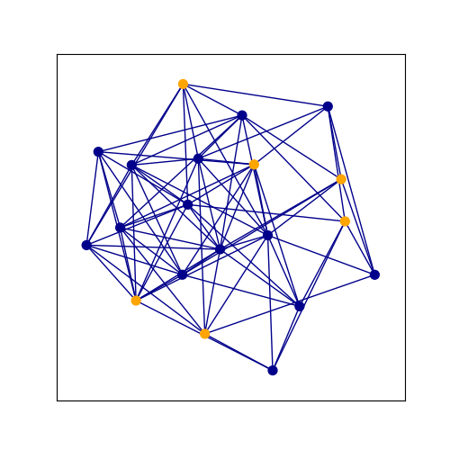
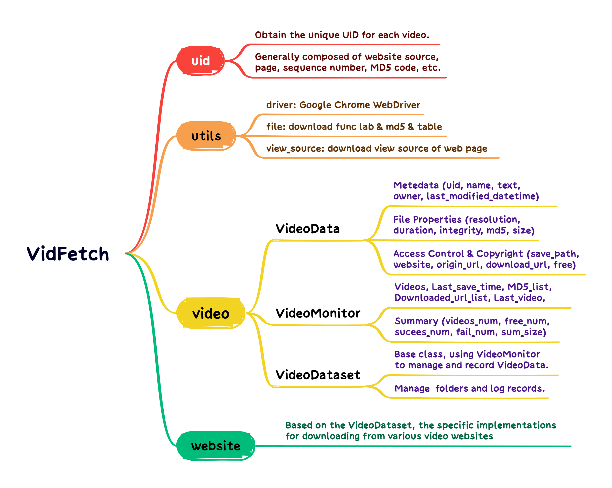

## [Introduction](#introduction)

**SJTU-TES**, SJTU Technology Engage Square, is an inclusive platform that aims to replicate cutting-edge technologies from diverse fields, enabling beginners to gain practical experience through hands-on projects and activities. 

We mark work contributed by **SJTU-TES** with ⭐.

We primarily use the following icons to indicate the organization of each repository.

**Paper Link** 

The corresponding published paper of the work, where "xxxx" refers to the name of the conference or journal in which it was published, and "arXiv" denotes the preprint version.

**Github Link** 

The corresponding github link of the work.

**Pretrained Link** 

The storage location of the pre-trained files for this repository (usually hosted on [Hugging Face](https://huggingface.co/) or [Google Drive](https://drive.google.com/)).

**Website Link** 

The webpage address for this work.

**⭐ Dataset Link** 

The dataset included with the work itself, as well as the datasets provided by the SJTU-TES team that are relevant to this work.

**⭐ Space Link** 

The reproduction of certain CPU-based work using the free space service provided by Hugging Face. You can visit the corresponding space to experience some practical applications of this work.

**⭐ Repro Link** 

There are some repositories that can only be run on GPUs (taking several hours or even days if run on CPUs), making it impractical to use the free space service provided by Hugging Face. Therefore, we provide reproducible repositories (including instructive README.md files) to address this limitation.

## [Content](#content)

<table>
<tr><td colspan="2"><a href="#AIGC">1. AIGC</a></td></tr> 
<tr>
	<td>&emsp;<a href=#text2img>1.1 Text2Img</a></td>
	<td>&emsp;<a href=#text2video>1.2 Text2Video</a></td>
</tr>
<tr>
	<td>&emsp;<a href=#img2text>1.3 Img2Text</a></td>
	<td>&emsp;<a href=#img2img>1.4 Img2Img</a></td>
</tr>
<tr>
	<td>&emsp;<a href=#deepfake>1.5 DeepFake</a></td>
</tr>

<tr><td colspan="2"><a href="#CO">2. CO</a></td></tr> 
<tr>
	<td>&emsp;<a href=#graph-matching>2.1 Graph Matching (GM)</a></td>
	<td>&emsp;<a href=#graph-edit-distance>2.2 Graph Edit Distance (GED)</a></td>
</tr>
<tr>
	<td>&emsp;<a href=#travelling-salesman-problem>2.3 Travelling Salesman Problem (TSP)</a></td>
	<td>&emsp;<a href=#maximum-independent-set>2.4 Maximum Independent Set (MIS)</a></td>
</tr>

<tr><td colspan="2"><a href="#website">3. Website</a></td></tr> 
<tr>
	<td>&emsp;<a href=#online-chatting>3.1 Online Chatting</a></td>
	<td>&emsp;<a href=#web-scraping>3.2 Web Scraping</a></td>
</tr>
<tr>
	<td>&emsp;<a href=#cpp-online>3.3 Cpp Online</a></td>
</tr>

<tr><td colspan="2"><a href="#motion">4. Motion</a></td></tr> 
<tr>
	<td>&emsp;<a href=#motion-retargeting>4.1 Motion Retargeting</a></td>
	<td>&emsp;<a href=#pose-estimation>4.2 Pose Estimation</a></td>
</tr>
<tr>
	<td>&emsp;<a href=#video-matting>4.3 Video Matting</a></td>
</tr>

<tr><td colspan="2"><a href="#security">5. Security</a></td></tr> 
<tr>
	<td>&emsp;<a href=#deepLearning-security>5.1 DeepLearning Security</a></td>
	<td>&emsp;<a href=#iot-security>5.2 IOT Security</a></td>
</tr>

</table>

## [AIGC](#content)

### [Text2Img](#content)

#### 1.1.1 Stable Diffusion v1.4  

``Stable Diffusion``, **a latent text-to-image diffusion model capable of generating photo-realistic images given any text input.** ``stable-diffusion-v1-4`` is resumed from ``stable-diffusion-v1-2`` - 225,000 steps at resolution 512x512 on ``laion-aesthetics v2 5+`` and 10 % dropping of the text-conditioning to improve.

#### 1.1.2 Stable Diffusion v1.5 

 

The ``stable-diffusion-v1-5`` checkpoint was initialized with the weights of the ``stable-diffusion-v1-2`` checkpoint and subsequently fine-tuned on 595k steps at resolution 512x512 on ``laion-aesthetics v2 5+`` and 10% dropping of the text-conditioning to improve classifier-free guidance sampling.

Click to view examples we have implemented

- Scarlett, nature, (((beauty))), (((smooth)))，white，Highest quality

### [Text2Video](#content)

#### 1.2.1 Latte

 

``Latte``, **a novel latent diffusion transformer for video generation**, utilizes spatio-temporal tokens extracted from input videos and employs a series of Transformer blocks to model the distribution of videos in the latent space. Latte achieves state-of-the-art performance on four standard video generation datasets ``FaceForensics``, ``SkyTimelapse``, ``UCF101``, and ``Taichi-HD``.

Click to view examples we have implemented

- Yellow and black tropical fish dart through the sea.
- An epic tornado attacking above aglowing city at night.
- Slow pan upward of blazing oak fire in an indoor fireplace.
- A cat wearing sunglasses and working as a lifeguard at pool.
- Sunset over the sea.
- A dog in astronaut suit and sunglasses floating in space.

### [Img2Text](#content)

#### 1.3.1 BLIP-2 

 

``BLIP-2``, **Bootstrapping Language-Image Pre-training with Frozen Image Encoders and Large Language Models**, BLIP-2 beats Flamingo on zero-shot VQAv2 (65.0 vs 56.3), establishing new state-of-the-art on zero-shot captioning (on NoCaps 121.6 CIDEr score vs previous best 113.2). Equipped with powerful LLMs (e.g. OPT, FlanT5), BLIP-2 also unlocks the new zero-shot instructed vision-to-language generation capabilities for various interesting applications!

Click to view examples we have implemented

- "Question: what is the main elements in the picture? "
- "Answer: the eiffel tower"

### [Img2Img](#content)

#### 1.4.1 Stable Diffusion v2 

 

``Stable Diffusion v2``, **high-resolution image synthesis with latent diffusion models**, This stable-diffusion-2 model is resumed from stable-diffusion-2-base (512-base-ema.ckpt) and trained for 150k steps using a v-objective on the same dataset. 

Click to view examples we have implemented

- ((two)) ((dogs)) in the picture, ((nature)), (((beauty))), (((smooth)))，white，Highest quality

	
	

### [DeepFake](#content)

#### 1.5.1 FaceSwap 

 

``FaceSwap``, **a tool that utilizes deep learning to recognize and swap faces in pictures and videos.** FaceSwap supports various operating systems(``windows``, ``linux``, ``macos``) and offers powerful face swapping capabilities, utilizing a modern GPU with CUDA support for optimal performance. With FaceSwap, users can gather photos and videos, extract faces from them, train a model based on the extracted faces, and then seamlessly swap faces in your sources using the trained model. 

#### 1.5.2 Roop 

 

``Roop``, **a fantastic tool of taking a video and replace the face in it with a face of users' choices.** Users only need one image of the desired face. No dataset, no training.

Click to view examples we have implemented

  
  
  

## [CO](#content)

### [Graph Matching](#content) 

#### 2.1.1 ⭐Pygmtools 

 

``pygmtools``, **Python Graph Matching Tools, provides graph matching solvers in Python.** To make researchers' lives easier, pygmtools support various solvers (``linear``, ``quadratic``, ``multi-graph``, ``neural``), various backends (``numpy``, ``pytorch``, ``jittor``, ``paddle``, ``tensorflow``, ``mindspore``). Also, pygmtools is deep-learning-friendly, whose operations are designed to best preserve the gradient during computation and batched operations support for the best performance. 

Click to view examples we have implemented

### [Graph Edit Distance](#content)

#### 2.2.1 ⭐GENN-A* 

 

``GENN-A*``, **Graph Edit Neural Network (GENN),** aims to accelerate the A* solver for graph edit distance problem based on Graph Neural Network. GENN-A* aided A* algorithm works by replacing the heuristic prediction module in A* by GNN. Since the accuracy of heuristic prediction is crucial for the performance of A*, this approach can significantly improve the efficiency of A*.

Click to view examples we have implemented

### [Travelling Salesman Problem](#content)

#### 2.3.1 ⭐T2T 

``T2T``, **Training to Testing.** T2TCO framework first leverages the generative modeling to estimate the high-quality solution distribution for each instance during training, and then conducts a gradient-based search within the solution space during testing.

Click to view examples we have implemented

  
  

### [Maximum Independent Set](#content)

#### 2.4.1 ⭐T2T 

``T2T``, **Training to Testing.** T2TCO framework first leverages the generative modeling to estimate the high-quality solution distribution for each instance during training, and then conducts a gradient-based search within the solution space during testing.

Click to view examples we have implemented

  
  

## [Website](#content)

### [Online Chatting](#content)

#### 3.1.1 ⭐GNetChat 

 

``GNetChat``, **General Networking Chat Website designed by SJTUGN Group,** where students can easily form study groups, create posts, make friends, share essential resources, and collaborate on projects in real-time.

Click to view details

### [Web Scraping](#content)

#### 3.2.1 ⭐VidFetch 

``VidFetch``, **an open-source dataset download tool to obtain copyright-free videos from various free video websites.** [code]()

Click to view details

### [Cpp Online](#content)

#### 3.3.1 ⭐web-cpp 

 

``web-cpp``, **an online platform that enables users to write and execute C++ code directly within their browsers.**

Click to view details

## [Motion](#content)

### [Motion Retargeting](#content)

#### 4.1.1 Transmomo 

 

``Transmomo``, **Invariance-Driven Unsupervised Video Motion Retargeting** A lightweight video motion retargeting approach that is capable of transferring motion in spite of structural and view-angle disparities between the source and the target.

Click to view details

#### 4.1.2 EDN 

 

``EverybodyDanceNow``, **A simple method for "do as I do" motion transfer:** Given a source video of a person dancing, we can transfer that performance to a novel (amateur) target after only a few minutes of the target subject performing standard moves.[code]()

Click to view details

### [Pose Estimation](#content)

#### 4.2.1 Openpose 

 

``Openpose``, **Real-time multi-person keypoint detection library for pose estimation** 2D real-time multi-person keypoint detection.We provide pytorch implementation of openpose including Body and Hand Pose Estimation.

Click to view details

### [Video Matting](#content)

#### 4.3.1 RobustVideoMatting 

 

``RVM``, **Robust High-Resolution Video Matting with Temporal Guidance** RVM is specifically designed for robust human video matting. Unlike existing neural models that process frames as independent images, RVM uses a recurrent neural network to process videos with temporal memory.

Click to view details

## [Security](#content)
### [DeepLearning Security](#content)

#### 5.1.1 ⭐DLSec 

 

``DLSec``, **Deep Learning model security evaluation platform** Taking attack paradigms and defense means such as anti-sample, data poisoning, backdoor attacks as examples, We studies and implements mainstream offensive and defensive algorithms for deep learning models, and builds a comprehensive and effective evaluation system for deep learning models from the perspectives of white box model and black box model.

#### 5.1.2 ⭐WDAD 

 

``WDAD``, **Adversarial sample detection based on weak dark textures**

Click to view details

#### 5.1.3 ⭐UAP 

 

``UAP``, **Fingerprinting Deep Neural Networks Globally via Universal Adversarial Perturbations"** a novel and practical mechanism which enables the service provider to verify whether a suspect model is stolen from the victim model via model extraction attacks.

### [IOT Security](#content)

#### 5.2.1 ⭐WAV2COM

 

``WAV2COM``, **Your Microphone Array Retains Your Identity: A Robust Voice Liveness Detection System for Smart Speakers**
